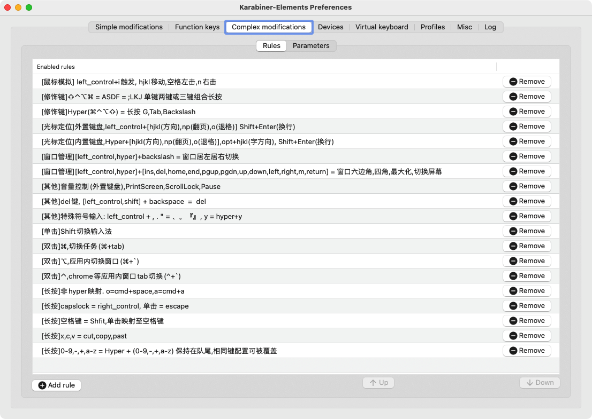
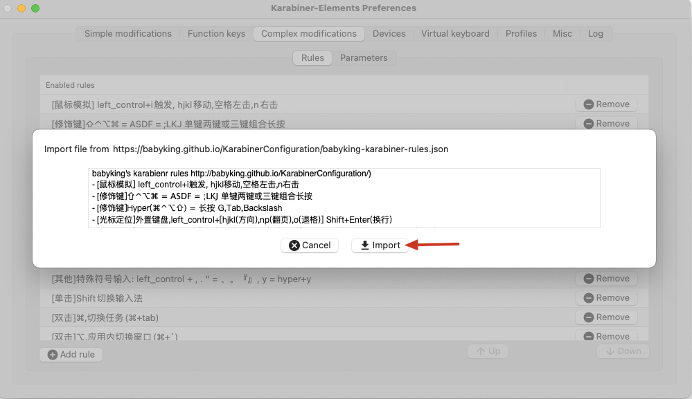
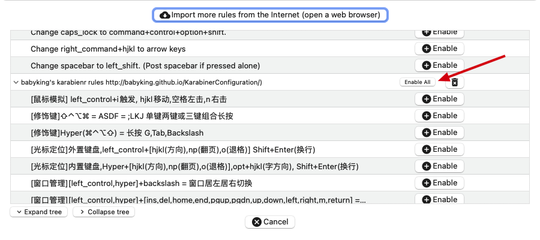
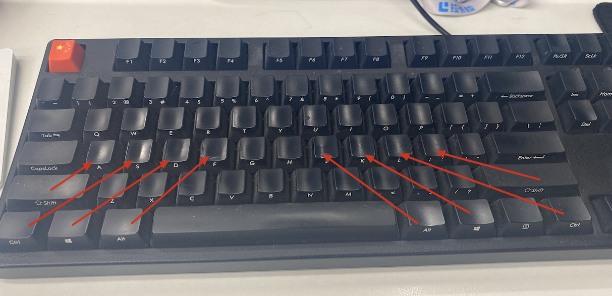
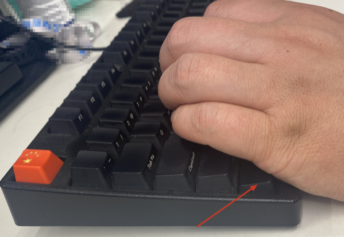
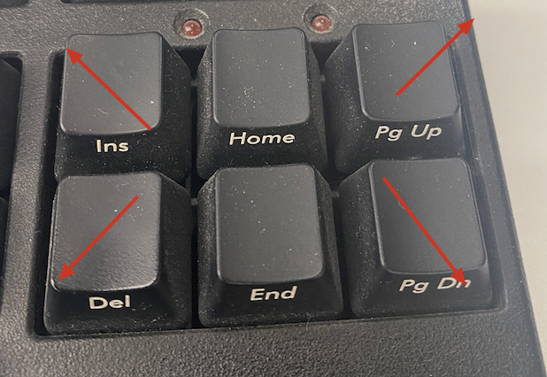
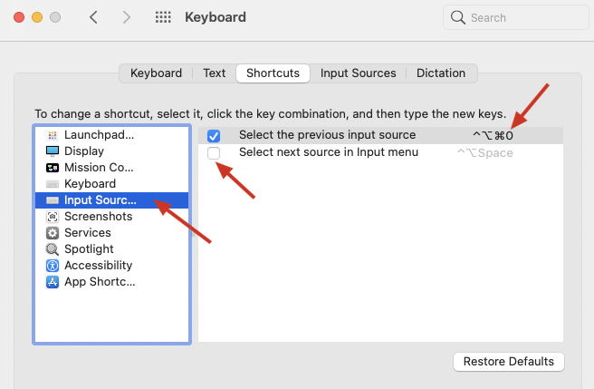
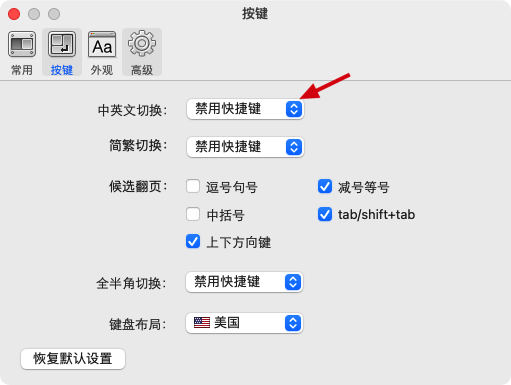

# karabiner 配置文件


## karabiner.json

> 最近更新: 2022年1月06日
>
> 今年把以前的配置重新整理了一下,内容大体没有什么变化,主要是做了一些分类,便于后面的管理和扩展,说是扩展,实际上我已经很久都没有动过这个配置了.




# 一、概要说明

主要分为以下几类:

* 鼠标模拟 

  键盘模拟鼠标

* 修饰键 

  hyper超级键的定义以及常用修饰键在键盘其他位置的映射.

* 单击、双击、长按

  顾名思义,这三类几乎是最重要的功能,特别是长按,提供了无冲突功能扩展.

* 光标定位

  主要用于文字处理中光标的快速定位,思路方式大多来自于vim和emacs.

* 窗口管理

  无实际的窗口管理功能,配合其他窗口管理程序提供无冲突的快捷键

* 其他

  不在以上的分类的杂项都放在这里.


# 二、快速安装配置

1. 如果你已经安装了karabiner-elements ,直接 [点击导入](karabiner://karabiner/assets/complex_modifications/import?url=https://babyking.github.io/KarabinerConfiguration/babyking-karabiner-rules.json)

   

   

2. 添加规则

   


# 二、分类详细说明


### [鼠标模拟] left_control+i触发, hjkl移动,空格左击,n右击

是在系统提供的鼠标模拟的配置上修改了. 在外置机械键盘上使用更符合手的位置. 左手小鱼际按下control键+i后,启动鼠标模式,hjkl控制方向,空格点击,n左击, 过程中,f键加速鼠标移动,d键减速,s键则把移动鼠标变成scroll


### [修饰键]⇧⌃⌥⌘ = ASDF = ;LKJ 单键两键或三键组合长按



看上图,是把常用的几个修饰键通过长按的方式,映射到几个键,键的位置关系跟原来的键的位置关系一至,适合打字状态时使用,无需移动手.  比如 cmd+f 可以长按 j+f,   cmd+option+f可以长按 jk+f.  几个修饰键是可以组合的,同时按下即可,不过要注意只支持单手键组合. 如果你同时长按下fk是不行的,也不方便.  另外四键组合不方便,可以使用下面的hyper键.

这是我平时打字时最为常用的快捷键. 


### [修饰键]Hyper(⌘⌃⌥⇧) = 长按 G,Tab,Backslash

超级键的定义,提供了几乎跟所有软件自身快捷键都无冲突的快捷键扩展.

Tab, backslash 从位置上是对称的,方便左右手对称操作. 下面很多的快捷键都是基于hyper键来进行定义的,hyper是整个配置的最重要的基础功能

G键跟tab,backslash 定义相同. 原因是我个人在使用笔记本内置键盘时,按G键相对更舒适. 你也可以根据自己的喜好来定义.  同样功能的键可以根据场景不同定义多个,择优使用.


### [光标定位]外置键盘,left_control+[hjkl(方向),np(翻页),o(退格)] Shift+Enter(换行)

外置机械键盘专用的文字光标定位,内容与下面的内容键盘光标定位基本上同.

光标定位主要包括方向键,翻页,退格,换行.

下图说明为什么外置键盘要用左下角的control做为lead key了.因为实在是太方便了. 包括下面的窗口管理也使用了left control. 




另外补充说明下,光标定位中的键盘的左下角的control键其实是映射到了 right_control,而上面的长按 s和 l则是映射到了left_control.这样做的好处就是键盘的左下角的control还是可以跟其他cmd,option作为组合键进行使用的.如果要直接使用 control+key的话,就需要使用长按s或l+key就可以了.  这样即可以使用control作为lead key,同时传统的control +key也有办法实现.


### [光标定位]内置键盘,Hyper+[hjkl(方向),np(翻页),o(退格)],opt+hjkl(字方向), Shift+Enter(换行)

功能与上面的外置键盘基本相同,只是lead key变成了hyper.


### [窗口管理]left_control,hyper+backslash = 窗口居左居右切换

这里不提供窗口管理的真正功能,只提供几个无冲突快捷键. 具体窗口管理功能请使用其他应用实现,在里面配置上这里的快捷键即可.

这里的lead key也是提供了外置键盘和内置键盘.  backslash就是"|" , 第一次按下窗口居左,再按一次就居右,是一个循环的状态. 实际上每按一次都是会映射到 hyper+左方向键 或是hyper+右方向键.  hyper+左右方向键才是真正的窗口居左居右的实际快捷键.

> 我自己是通过hammerspoon进行窗口管理的.相应的快捷键在hs里配置参考如下

```lua
local hyper = { 'ctrl', 'alt', 'shift', 'cmd' }

-- 左右上下
hs.hotkey.bind(hyper, 'left',   function() hs.window.focusedWindow():move(units.left,  nil, true) end)
hs.hotkey.bind(hyper, 'right',  function() hs.window.focusedWindow():move(units.right, nil, true) end)
hs.hotkey.bind(hyper, 'up',     function() hs.window.focusedWindow():move(units.up,    nil, true) end)
hs.hotkey.bind(hyper, 'down',   function() hs.window.focusedWindow():move(units.down,  nil, true) end)
```


### \[窗口管理\][left_control,hyper]+[ins,del,home,end,pgup,pgdn,up,down,left,right,m,return] = 窗口六边角,四角,最大化,切换屏幕

也是分外置键盘和内置键盘, 同样,外置键盘只是把以 control作lead key 映射到了hyper作为lead key.  

除了上面配置的最常用的居左居右, 这里主要包括以下几个最常用的窗口管理

1. hyper+上下左右键就是窗口的上下左右
2. hyper+回车, 在两个不同的显示器内切换
3. hper+m 最大化.  (这个最为常用,以至于下面长按m也映射成了这个)
4. ins,del,pgup,pgdn在外置键盘上的位置是四个角,对应窗口四个角的位置 (见下图)




### [其他]音量控制(外置键盘),PrintScreen,ScrollLock,Pause

这三个键平时没啥用,就映射为音量减小,静音开关,音量增大.   

### [其他]del键, [left_control,shift] + backspace  =  del

mac本身是通过fn+backspace实现的,同样为了方便重新映射

### [其他]特殊符号输入: left_control + , . \" = 、。『』, y = hyper+y",

输入中文一直不使用全角,但有的时候也会需要这些全角的符号.

英文的逗号`,`转成顿号`、` 点`.`转成句号`。`  双引号`"`转成`『』`

### [单击]Shift切换输入法

这个对我比较重要,不喜欢使用中文输入法的中英状态,但切换输入法需要组合键,所以将单击shift映射至 ctrl+option+cmd+0,原有的shift键功能不受影响. 再系统配置键盘中设置如下 :

                       

同时在具体的输入法配置中把shift切换中英状态禁用,一般输入法默认都是会启用.




这样在只有中英两个输入法的情况下,就可以一键shift切换输入法了.很方便


### [双击]⌘,切换任务(⌘+tab)

略

### [双击]⌥,应用内切换窗口(⌘+`)

略

### [长按]非hyper映射. o=cmd+space,a=cmd+a

这个是我私人的配置,我把一些舒适的几个字母,像食指中指无名指负责的字符都算, 用于重要的最为频繁使用的软件操作上

只作为参考,你可以自己根据需要自己定制.以下是我的习惯

1. 长按o映射到cmd+space,用于alfred的启动
2. 长按a映射到cmd+a,全选文字太常用
3. 长按y映射到hyper+y, 也是alfred里的粘贴板历史,使用极为频繁

像w,e,r,t等都用在了alfred或是keyboard maestro这类效率工具的最为常用的功能上


### [长按]capslock = right_control, 单击 = escape

这个基本就是为vi或是vi模式专用的,主要esc键, 至于长按映射到control现在都不怎么用了,毕竟有长按s和l.

### [长按]空格键 = Shfit,单击映射至空格键

现在输入上档字符我已经基本不会用小指来按Shift了.

这是一个高频操作,但确是用力量最弱也最没效率的小指来完成的. 

这个映射非常重要,解放了小指,同时也使得cpaslock键变的没有意义,连续的输入大写字母,按下空格键后,连续输入反而比capslock这样的开关键要方便.

### [长按]x,c,v = cut,copy,past

应该是所有人最高频的操作了,单独列出.


### [长按]0-9,-,+,a-z = Hyper + (0-9,-,+,a-z) 保持在队尾,相同键配置可被覆盖

把所有的可打印字符都配置了长按模式,默认就是映射至 hyper+key. 这条配置请保证在配置的最后,如果需要单设置某key的长按,请在这条配置上方进行单配置,karabiner会覆盖这个配置中的值. (上面很多长按键的也是这样做的)

本条配置提供了无冲突的快捷键映射,可以在很多软件里进行.


