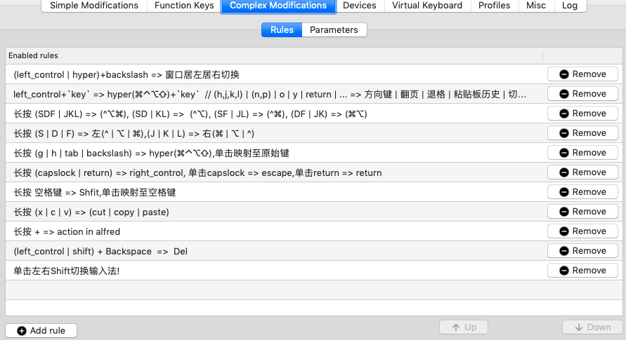
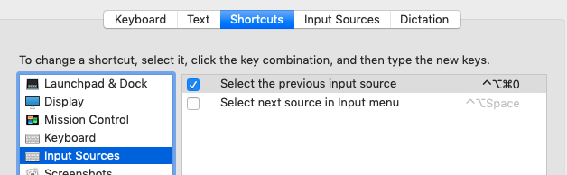

# karabiner 配置文件

## karabiner.json

karabiner-element 的配置文件,是以karabiner 10.22 版本的自定义配置为基础来实现的,虽然配置文件一个是xml,一个是json,软件也基本可以认为是两个了,但定义的功能基本差不多,主要围绕着hyper键定义以及键的长按模式为基础,在这个基础上定义更多的功能扩展.

hyper键是 cmd,option,shift,control这四个键的组合.

很多功能都是以hyper键+key的组合,为了方便,hyper键有多个,方便不同场景使用. 我按自己的习惯把 tab, \ ,g 这几个键的长按模式映射为hyper键. Tab,\ 更习惯用左右手的无名指,之所以映射到g键,是在不外接键盘直接使用笔记本自带键盘的时候,食指相对更为舒适,纯属个人习惯.

配置中有很多hyper+key的功能我又使用left_control键重新定义了一便,原因很简单,我使用filco外接机械键盘,使用左手的外侧手掌压ctr键作为hyper键来进行组合更为方便,但如果直接把left_control直接映射为hyper键会导致常用的跟ctrol的组合键受影响.所以干脆重新把这些功能重新复制了一次,同样,也是个人习惯.

下面说说这些定义的项都做了些什么事情.

### left_control | hyper)+backslash => 窗口居左居右切换

这个窗口居左居右的功能并不是karabiner el自己实现了,我用的是sizeup来管理窗口,窗口的居左居右是我最常用的功能,在sizeup里也是分别有两个快捷键来完成的. 当然,我也使用了left_control + 左右方向键来映射这个功能,但在打字输入场景下我希望能更方便做这样的切换,使用一个快捷键来toggle切换窗口的左右位置.因为不是左就是右,对于快捷键的使用更多的是惯性,不需要考虑哪个键是居左,哪个键是居右,而且一般两个窗口并排的情况下,前一个居左了,下一个同样的键正好是居右. 这里面只是做了同一个组合键的toggle切换,这个状态切换可以用于很多其他的情况.

### left_control+`key` => hyper(⌘⌃⌥⇧)+`key`  // (h,j,k,l) | (n,p) | o | y | return | ... => 方向键 | 翻页 | 退格 | 粘贴板历史 | 切屏 | ... 

上面说了,只是因为使用机械键盘我更喜欢把left_control当成hyper键来使,所以做了个映射,个人习惯 

### **长按 (SDF | JKL) => (^⌥⌘), (SD | KL) =>  (^⌥), (SF | JL) => (^⌘), (DF | JK) => (⌘⌥)**

### 长按 (S | D | F) => 左(^ | ⌥ | ⌘),(J | K | L) => 右(⌘ | ⌥ | ^)

这个要说说,打字输入状态需要短暂使用修饰键时,总是需要把手离开主键区,现在好了,直接把SDF JKL这几个键按修饰键的位置做了映射,可以手在原地很方便的按下各种组合键.

特别是我把option键+key作为各个APP的热启动键(热启动实现是用keyboard maestro实现的),在持续输入的情况下需要临时切换应用查看信息就会变得特别有效,在这之前,我也是重度依赖 CMD+Tab.

顺带说一下,ctr键在macOS下大多数的软件里都有保留emacs的文字编辑默认键,这样的映射对于文字的编辑非常快捷.行首,行尾,删除到行尾几乎可以无缝切换.

### 长按 (g | tab | backslash) => hyper(⌘⌃⌥⇧),单击映射至原始键

这个前面说了,不再赘述.

### 长按 (capslock | return) => right_control, 单击capslock => escape,单击return => return

同样是为了不同场景实现相同的功能,对于非输入场景,左边的capslock与右边的回车键几乎是我使用control键的首选了,macbook的右侧的control键的缺失,以及外接键盘的右侧的control键有些远是这个定义的最初目的. 另外capslock的短按会映射到ESC,这个对于Vim党来说也是很重要的,左上角的ESC已经很久不用了.

### 长按 空格键 => Shfit,单击映射至空格键

现在输入上档字符我已经基本不会用小指来按Shift了.

这是一个高频操作,但确是用力量最弱也最没效率的小指来完成的. 

这个映射非常重要,解放了小指,同时也使得cpaslock键变的没有意义,连续的输入大写字母,按下空格键后,连续输入反而比capslock这样的开关键要方便.

### 长按 (x | c | v) => (cut | copy | paste)

copy,cut,paste,这几个超高频操作,在右手握着鼠标,左手孤立无援的情况下更为有用.

### 长按 + => action in alfred

个人习惯 ,alfred里的action快捷键的映射,对于超高频的一些操作更喜欢单手一键完成.

### left_control | shift) + Backspace  =>  Del

这个没啥说的,不喜欢macbook的fn+Delete键而已

### 单击左右Shift切换输入法

切换输入法,又是一个超高频的操作,只是一个快捷键的映射,这个快捷键是在系统设置里自己定义的.

切换输入法这个事情想来想去,最方便的还是一键,虽然中文输入法中也有一键shift切换中英文状态,但是对于coding来说我没有安全感,有时候中文状态下的一些字符与英文下的总是会混在一起.

同时配合 karabiner el 同家出的ShowyEdge这个app,效果更好.

总之,切换输入法应该是一个下意识的肌肉操作,不应该需要眼睛定焦,也不能对当前的行为有暂停的影响.

最后

> 上面的这些定义也是反反复复,不停在变,最近的这个配置估计后面应该会有很长时间不会变了,因为对于个人来说已经基本是肌肉记忆了.这些配置说起来基本也挺无聊的,只是因为有一天发现写程序可以抽象,封装,提供复用性,对于平常的这些高频的操作,是不是也需要进行一些抽象封装,也是一种效率的提升.

### private.xml

>  Karabiner 10.22 版本的配置,现在是9012年了,应该没人会需要这个配置了吧.

